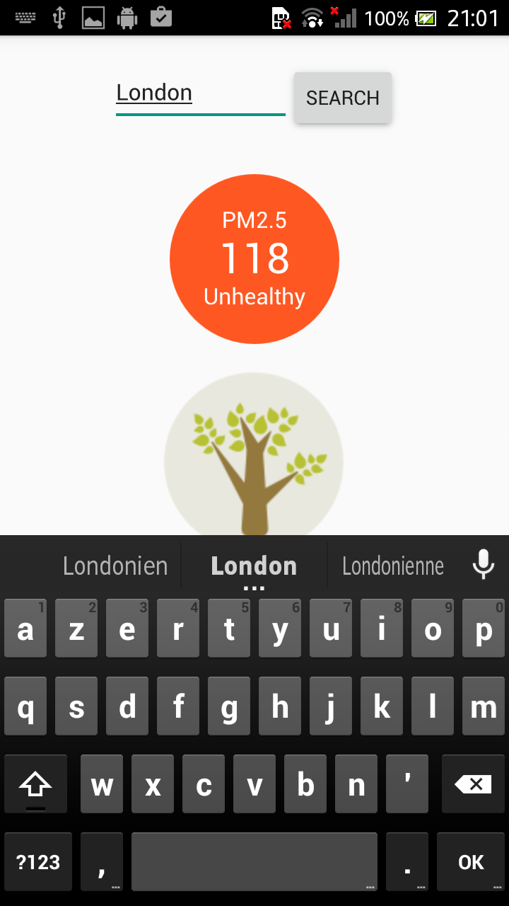
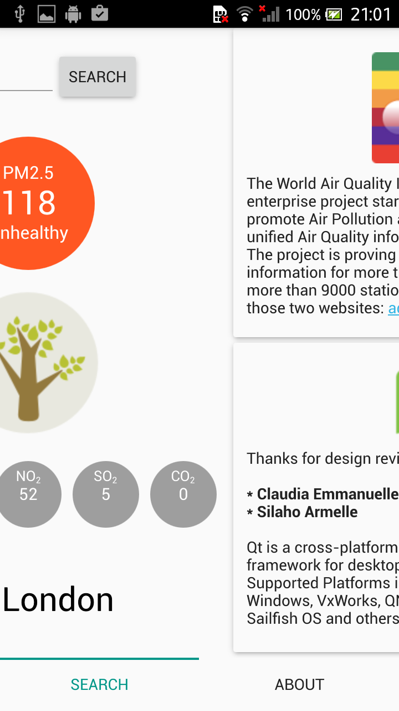

# iFresh

iFresh is a simple, beautiful and modern application that provides the current pollution status.
The current pollution status is obtained from Air Quality Information (AQI) servers.
AQI provides a transparent Air Quality information for more than 70 countries, covering more than 9000 stations in 600 major cities.

  
  

iFresh is made with the following Technologies :

- Qt for Android Technology.
- Json for getting data
- QML for declarative part of the aplication
- C++ for the backend
- Google unit tests for the Unitary testing :-)
